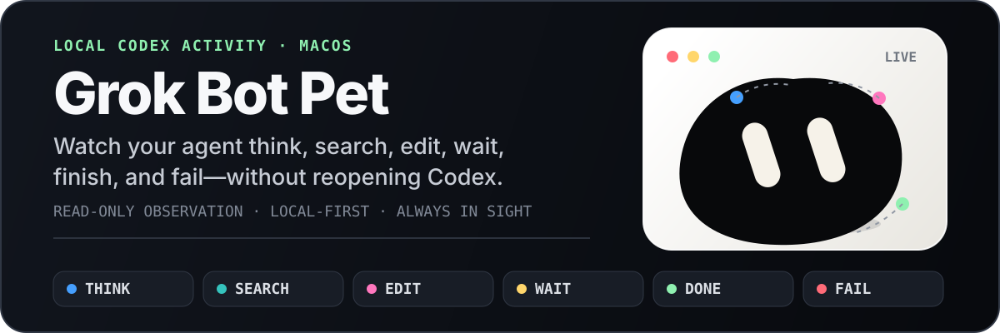

<p align="center">
  
</p>

<p align="center">
  <strong>English</strong> · <a href="README.zh-CN.md">简体中文</a>
</p>

<p align="center">
  <code>macOS 13+</code>&nbsp;&nbsp;<code>Local-first</code>&nbsp;&nbsp;<code>Read-only</code>&nbsp;&nbsp;<code>Electron</code>&nbsp;&nbsp;<code>TypeScript</code>
</p>

> [!NOTE]
> Grok Bot Pet is an unofficial community project. Its character concept, visual language, and core animation behavior originate from and are inspired by **Grok Bot**. It is not affiliated with, endorsed by, or sponsored by OpenAI or xAI.

## See Codex at a glance

Grok Bot Pet translates local Codex desktop and CLI activity into a character that lives directly on your macOS desktop. The pet stays visible while tasks, controls, and customization remain tucked into the menu bar.

| Codex signal | What the pet does |
| --- | --- |
| Reasoning or planning | Thinks and shows progress |
| Web search | Scans and searches |
| Commands and tools | Works, loads, and orbits |
| File changes | Writes and uploads |
| Approval or input needed | Listens and waits |
| Agent reply | Dictates and sends |
| Task completed | Celebrates |
| Task failed | Alerts, reacts, and becomes sad |
| Task interrupted | Powers down |

## Install

1. Download the latest Universal `.dmg` or `.zip` from [GitHub Releases](../../releases).
2. Move **Grok Bot Pet.app** to `/Applications`.
3. Launch the app and use the pet icon in the macOS menu bar.

Release builds are signed with an Apple Developer ID and notarized by Apple. macOS may still show its standard downloaded-app confirmation the first time you open it.

> [!TIP]
> Share the packaged `.dmg` or `.zip`, not a bare `.app`. Some chat and cloud services can damage an unpackaged App Bundle.

## Why it feels at home on your desktop

- Transparent, frameless, draggable, and always on top.
- Visible across macOS Spaces and full-screen desktops.
- Expressive shapes, colors, particles, ribbons, and motion for task state.
- Menu bar access to current tasks, connection controls, and customization.
- Adjustable size, opacity, body and eye colors, shape, shadow, badge, animation, and pointer following.
- Click interactions for small moments of personality between tasks.

## How it works

```text
Codex desktop / CLI
        ↓
local App Server + session information
        ↓
activity and task-state inference
        ↓
animation director
        ↓
floating desktop pet
```

The app uses the local Codex App Server when available and falls back to local Codex session information for CLI visibility. Detection detail can vary by Codex version.

Grok Bot Pet only observes activity. It never creates, interrupts, deletes, approves, or replies to a Codex task.

## Run from source

You need a current Node.js LTS release and Xcode Command Line Tools. Install the command-line tools with `xcode-select --install` if needed; they compile the native macOS window bridge.

```bash
npm ci
npm run dev
```

Useful checks and builds:

```bash
npm run typecheck
npm test
npm run build
npm run build:mac
```

## Requirements and limits

- macOS 13 or later on Apple Silicon or Intel Mac.
- Codex for macOS, Codex CLI, or a compatible Codex installation.
- No screen recording or Accessibility permission required.
- No automatic updates yet; install new releases manually.
- Task content is not uploaded to a third-party service by Grok Bot Pet.

## Attribution and intellectual property

The core character animation mechanics originate from Grok Bot and were studied, ported, and reimplemented in TypeScript for this project. This repository does not claim ownership of the Grok Bot character design, visual identity, name, or related trademarks.

**Grok**, **Grok Bot**, xAI, and their related designs and marks belong to their respective rights holders. **Codex**, OpenAI, and their related marks also belong to their respective rights holders.

The [MIT License](LICENSE) applies only to this project's original implementation code. It does **not** grant rights to third-party trademarks, character designs, visual identities, or protected assets. Keep this attribution when redistributing or modifying the project, and review whether your intended use is permitted in your jurisdiction.

See [Third-Party Notices](THIRD_PARTY_NOTICES.md) for the complete notice.

## Disclaimer

- This repository is provided solely for learning and research. It grants no permission for commercial use or redistribution.
- All character designs, names and trademarks, icons, visual elements, geometry data, and any material extracted from application bundles belong to xAI or the applicable rights holders.
- Without express authorization from the applicable rights holders, do not use the above material commercially, redistribute it, or present it publicly as your own trademark, original asset, or work.
