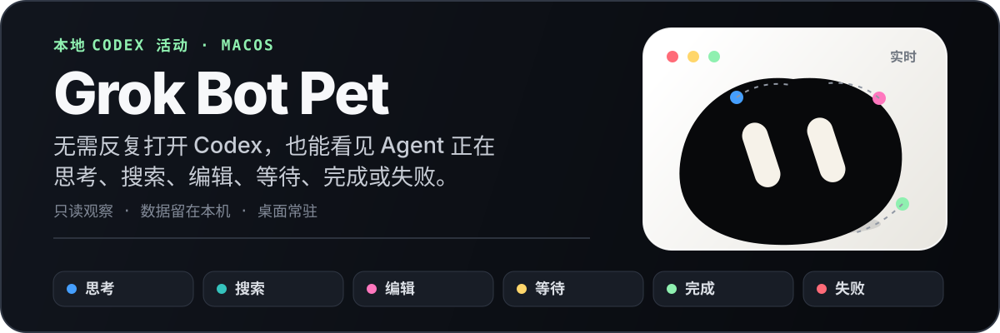

<p align="center">
  
</p>

<p align="center">
  <a href="README.md">English</a> · <strong>简体中文</strong>
</p>

<p align="center">
  <code>macOS 13+</code>&nbsp;&nbsp;<code>本地优先</code>&nbsp;&nbsp;<code>只读观察</code>&nbsp;&nbsp;<code>Electron</code>&nbsp;&nbsp;<code>TypeScript</code>
</p>

> [!NOTE]
> Grok Bot Pet 是非官方社区项目。角色概念、视觉语言和核心动画机制来源于并参考了 **Grok Bot**，与 OpenAI、xAI 不存在隶属、背书或赞助关系。

## 一眼看懂 Codex 状态

Grok Bot Pet 会把本机 Codex 桌面端和 CLI 的活动转换成常驻 macOS 桌面的动态角色。宠物始终可见，任务、控制和自定义选项则安静地收在系统状态栏中。

| Codex 信号 | 宠物反应 |
| --- | --- |
| 推理或规划 | 思考并展示进度 |
| 网页搜索 | 扫描和搜索 |
| 命令与工具 | 工作、加载和环绕 |
| 文件修改 | 书写和上传 |
| 等待批准或输入 | 倾听并等待 |
| Agent 回复 | 口述并发送 |
| 任务完成 | 庆祝 |
| 任务失败 | 警示、应激并变得难过 |
| 任务中断 | 逐步关机 |

## 安装

1. 从 [GitHub Releases](../../releases) 下载最新 Universal `.dmg` 或 `.zip`。
2. 将 **Grok Bot Pet.app** 移入 `/Applications`。
3. 启动 App，通过 macOS 系统状态栏中的宠物图标使用。

正式发布的安装包已使用 Apple Developer ID 签名并通过 Apple 公证。首次启动时，macOS 仍可能显示标准的“从互联网下载”确认提示。

> [!TIP]
> 对外分享时请发送打包好的 `.dmg` 或 `.zip`，不要直接发送裸 `.app`；部分聊天软件和网盘可能破坏未打包的 App Bundle。

## 自然融入 macOS 桌面

- 透明无边框、可拖动、始终置顶。
- 可跨 macOS 桌面空间和全屏应用显示。
- 用形状、颜色、粒子、丝带和动作反馈任务状态。
- 在系统状态栏查看任务、控制连接并自定义角色。
- 可调整尺寸、透明度、身体及眼睛颜色、形状、阴影、角标、动画和鼠标跟随。
- 点击宠物可以触发轻量的随机互动。

## 工作方式

```text
Codex 桌面端 / CLI
        ↓
本地 App Server + 会话信息
        ↓
活动与任务状态推断
        ↓
动画导演
        ↓
桌面悬浮宠物
```

App 会优先连接本机 Codex App Server，并使用本地 Codex 会话信息补充 CLI 任务识别。不同 Codex 版本能提供的状态细节可能有所不同。

Grok Bot Pet 只观察活动，不会创建、中断、删除或批准任务，也不会代替用户回复。

## 从源码运行

你需要当前 Node.js LTS 版本和 Xcode Command Line Tools。尚未安装时可运行 `xcode-select --install`；命令行工具用于编译原生 macOS 窗口桥接模块。

```bash
npm ci
npm run dev
```

常用检查与构建命令：

```bash
npm run typecheck
npm test
npm run build
npm run build:mac
```

## 系统要求与限制

- 支持 Apple Silicon 和 Intel Mac，需要 macOS 13 或更高版本。
- 需要 Codex macOS 桌面端、Codex CLI 或兼容的 Codex 安装。
- 不需要屏幕录制或辅助功能权限。
- 暂未实现自动更新，需要手动安装新版本。
- Grok Bot Pet 不会把任务内容上传到第三方服务。

## 来源与知识产权

本项目的角色核心动画机制来源于 Grok Bot，并在研究其动画表现后，以 TypeScript 进行移植和重新实现。本仓库不主张拥有 Grok Bot 的角色设计、视觉识别、名称或相关商标权利。

**Grok**、**Grok Bot**、xAI 及其相关设计和标识的权利归各自权利人所有；**Codex**、OpenAI 及其相关标识同样归各自权利人所有。

[MIT License](LICENSE) 只适用于本项目的原创实现代码，**不授予**任何第三方商标、角色设计、视觉识别或受保护资产的权利。重新分发或修改本项目时请保留这份来源声明，并自行确认相关使用在所在司法辖区是否获得允许。

完整说明请参阅 [Third-Party Notices](THIRD_PARTY_NOTICES.md)。

## 免责声明

- 本仓库仅供学习与研究参考，不授予任何商业使用或再分发权限。
- 仓库所涉角色造型、名称与商标、图标、视觉元素、几何数据，以及从应用包提取的任何内容，均归 xAI 或相应权利人所有。
- 未经相关权利人明确授权，请勿将上述内容用于商业目的、再分发，或作为自己的商标、原创素材或作品对外发布。
